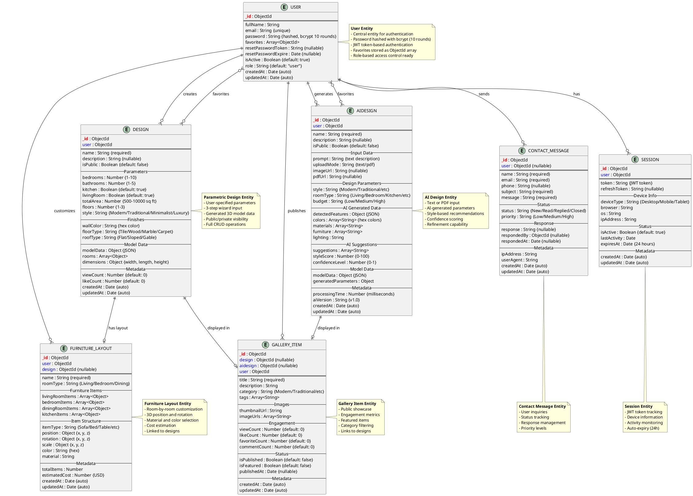
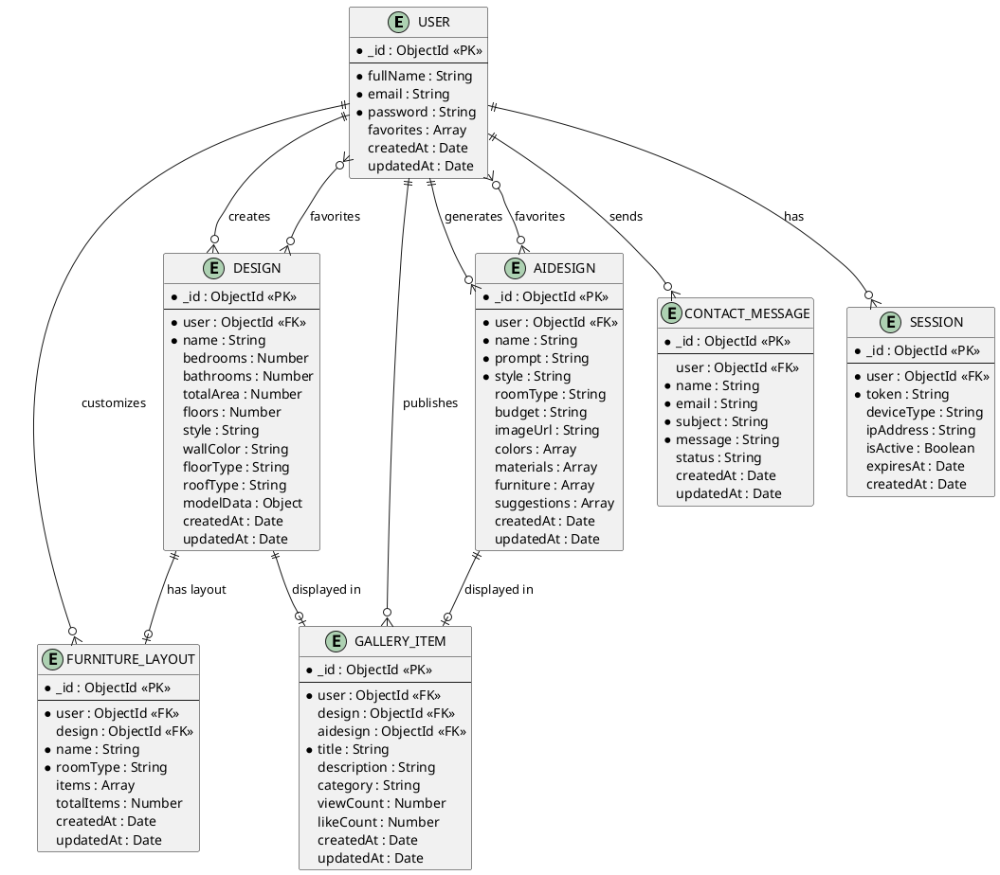
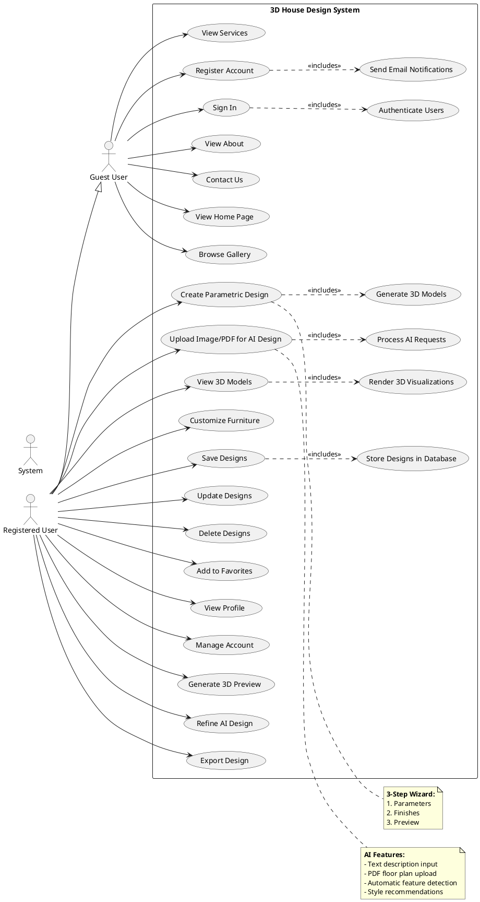
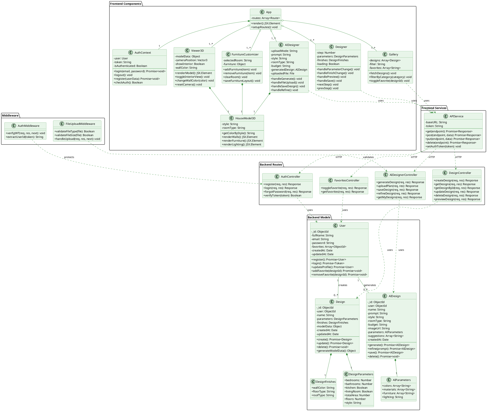
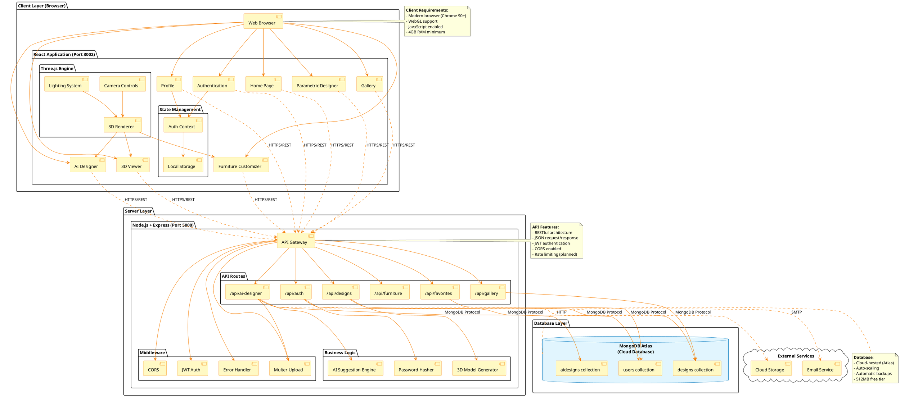
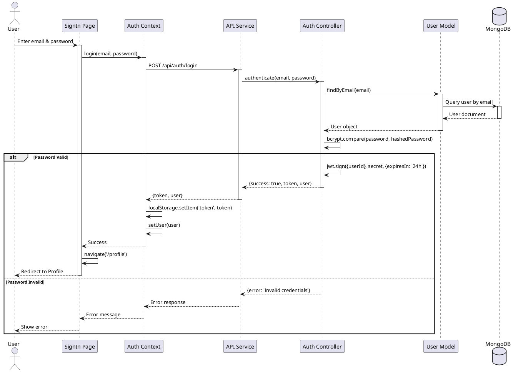
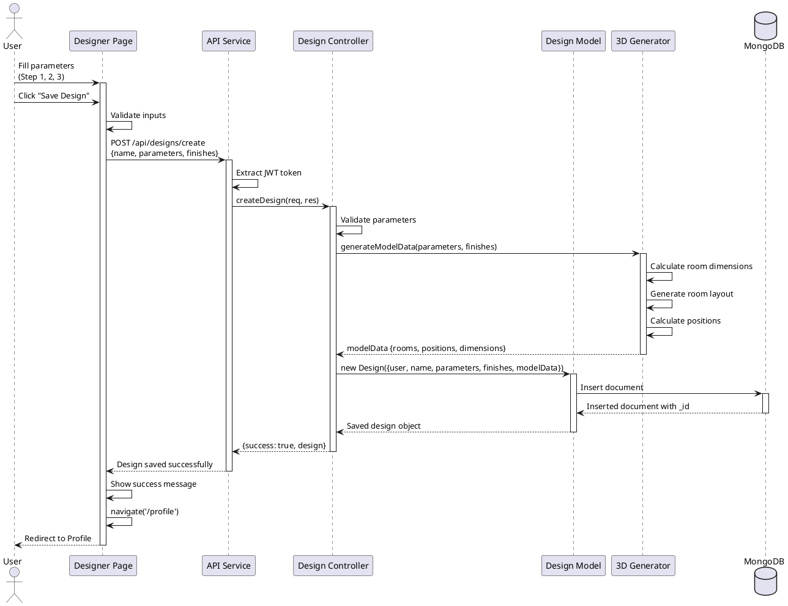
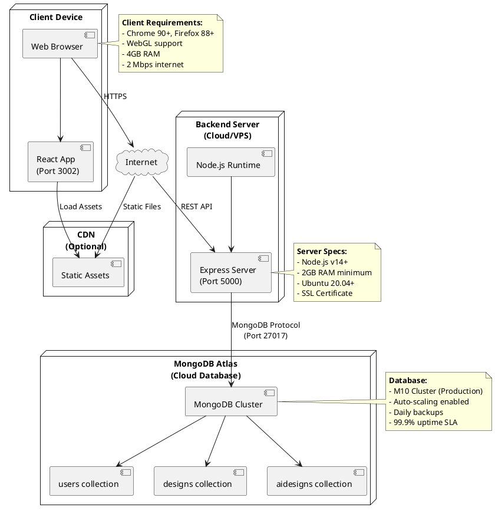

```plantuml
@startuml Component_Diagram_3D_House_Design

package "Frontend Application" {
    [React Router] as router
    [Auth Context Provider] as authprovider
    
    package "Pages" {
        [Home] as home
        [SignIn/Register] as auth
        [Designer] as designer
        [AI Designer] as aidesigner
        [3D Viewer] as viewer
        [Furniture Customizer] as furniture
        [Gallery] as gallery
        [Profile] as profile
    }
    
    package "Components" {
        [HouseModel3D] as model3d
        [Navbar] as navbar
        [Footer] as footer
    }
    
    package "Services" {
        [API Service] as apiservice
    }
    
    package "3D Engine" {
        [Three.js] as threejs
        [React Three Fiber] as fiber
        [Drei Helpers] as drei
    }
}

package "Backend Application" {
    [Express Server] as express
    
    package "Routes" {
        [Auth Routes] as authroutes
        [Design Routes] as designroutes
        [AI Routes] as airoutes
        [Favorites Routes] as favroutes
    }
    
    package "Middleware" {
        [Auth Middleware] as authmw
        [CORS Middleware] as corsmw
        [Multer Middleware] as multermw
    }
    
    package "Models" {
        [User Model] as usermodel
        [Design Model] as designmodel
        [AIDesign Model] as aidesignmodel
    }
    
    package "Utils" {
        [JWT Utils] as jwtutils
        [Bcrypt Utils] as bcryptutils
        [Model Generator] as modelgen
    }
}

database "MongoDB Atlas" {
    [users] as users
    [designs] as designs
    [aidesigns] as aidesigns
}

' Frontend Internal Connections
router --> home
router --> auth
router --> designer
router --> aidesigner
router --> viewer
router --> furniture
router --> gallery
router --> profile

authprovider --> auth
authprovider --> profile

designer --> model3d
aidesigner --> model3d
viewer --> model3d
furniture --> model3d

home --> navbar
auth --> navbar
designer --> navbar

home --> footer
gallery --> footer

apiservice --> authroutes : HTTP
apiservice --> designroutes : HTTP
apiservice --> airoutes : HTTP
apiservice --> favroutes : HTTP

model3d --> threejs
model3d --> fiber
model3d --> drei

' Backend Internal Connections
express --> authroutes
express --> designroutes
express --> airoutes
express --> favroutes

express --> authmw
express --> corsmw
express --> multermw

authroutes --> usermodel
authroutes --> jwtutils
authroutes --> bcryptutils

designroutes --> designmodel
designroutes --> modelgen
designroutes --> authmw

airoutes --> aidesignmodel
airoutes --> multermw
airoutes --> authmw

favroutes --> usermodel
favroutes --> authmw

' Database Connections
usermodel --> users
designmodel --> designs
aidesignmodel --> aidesigns

@enduml
```

# 3D House Design Web Application - System Diagrams
## PlantUML Diagrams for Interim Report

---

## 1. Entity-Relationship (ER) Diagram - Full System

### Complete ER Diagram with All Attributes (PlantUML for Draw.io)

**Instructions for Draw.io:**
1. Go to https://app.diagrams.net/
2. Click "Create New Diagram"
3. Select "Blank Diagram"
4. Go to: Arrange → Insert → Advanced → PlantUML
5. Paste the code below
6. Click "Insert"



### Alternative: Simplified Version for Better Rendering



---

## 2. Use Case Diagram

### PlantUML Code:



---

## 3. Class Diagram

### PlantUML Code:



---

## 4. High-Level System Architecture Diagram

### PlantUML Code:



---

## 5. Sequence Diagram - User Authentication Flow

### PlantUML Code:



---

## 6. Sequence Diagram - Parametric Design Creation

### PlantUML Code:



---

## 7. Component Diagram

### PlantUML Code:



---

## 8. Deployment Diagram

### PlantUML Code:



---

## How to Use These Diagrams:

### 1. Online PlantUML Editors:
- **PlantUML Web Server**: http://www.plantuml.com/plantuml/uml/
- **PlantText**: https://www.planttext.com/
- **Gravizo**: http://www.gravizo.com/

### 2. VS Code Extension:
- Install "PlantUML" extension
- Create `.puml` files
- Preview with Alt+D

### 3. Generate Images:
```bash
# Install PlantUML
npm install -g node-plantuml

# Generate PNG
puml generate diagram.puml -o output.png
```

### 4. For Your Report:
1. Copy the PlantUML code
2. Paste into online editor
3. Export as PNG/SVG
4. Insert into Word document
5. Add caption below each diagram

---

**End of Diagrams Documentation**

